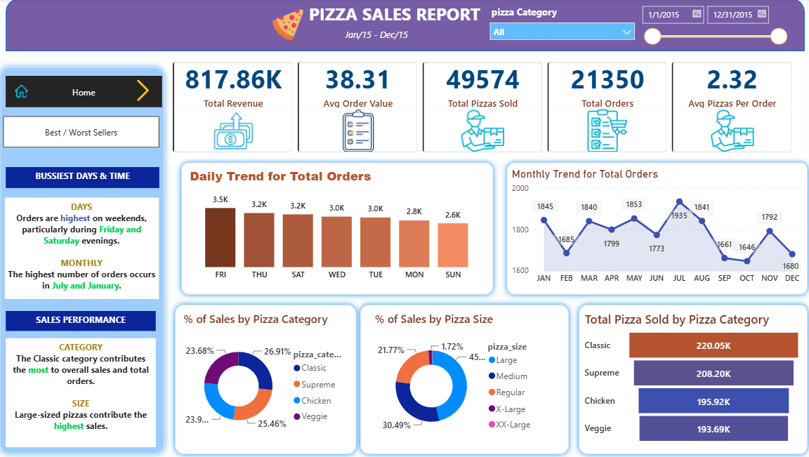

# 🍕 Pizza Sales Report — SQL + Power BI Dashboard

An end-to-end data analytics project that turns raw pizza order data into an interactive, insight-rich Power BI dashboard. **SQL** was used to explore and answer the business questions, and **Power BI** was used to model the data and build a clean, two-page executive dashboard.



---

## 📌 Project Overview

The goal of this project is to analyze a full year of pizza sales (Jan 2015 – Dec 2015) and answer key business questions around **revenue, order volume, customer behavior, and product performance**. The final report helps stakeholders quickly understand *what's selling, when it's selling, and what needs attention*.

The dashboard is split into two pages:

1. **Home** – High-level KPIs and sales trends (daily, monthly, category, and size breakdowns).
2. **Best / Worst Sellers** – Product-level deep dive into top and bottom performers.

---

## 🎯 Key Business Questions

This project was built to answer questions such as:

- What is the **total revenue, total orders, and total pizzas sold**?
- What is the **average order value** and **average pizzas per order**?
- Which are the **busiest days and months** for orders?
- How do sales split across **pizza categories** and **pizza sizes**?
- Which pizzas are the **best sellers** (by revenue, quantity, and orders)?
- Which pizzas are the **worst sellers** and may need to be reviewed?

---

## 📊 Key Performance Indicators (KPIs)

| Metric | Value |
|---|---|
| 💰 **Total Revenue** | **$817.86K** |
| 🧾 **Avg Order Value** | **$38.31** |
| 🍕 **Total Pizzas Sold** | **49,574** |
| 📦 **Total Orders** | **21,350** |
| 📈 **Avg Pizzas Per Order** | **2.32** |

---

## 🔍 Dashboard Highlights

### 🏠 Page 1 — Home


**Busiest Days & Time**
- Orders are **highest on weekends**, particularly during **Friday and Saturday** evenings.
- On a monthly basis, the highest number of orders occurs in **July and January**.

**Sales Performance**
- The **Classic** category contributes the **most** to overall sales and total orders.
- **Large-sized** pizzas contribute the **highest** sales.

**Visuals include:**
- Daily Trend for Total Orders
- Monthly Trend for Total Orders
- % of Sales by Pizza Category (Classic leads at **26.91%**)
- % of Sales by Pizza Size (Large leads at ~**45%**)
- Total Pizzas Sold by Pizza Category

---

### 🏆 Page 2 — Best / Worst Sellers


**🥇 Best Sellers**
- **Revenue:** *The Thai Chicken Pizza* contributes the highest revenue.
- **Quantity:** *The Classic Deluxe Pizza* has the highest total quantity sold.
- **Total Orders:** *The Classic Deluxe Pizza* has the highest total number of orders.

**🥉 Worst Sellers**
- **Revenue:** *The Brie Carre Pizza* has the minimum revenue.
- **Quantity:** *The Brie Carre Pizza* contributes the minimum total quantity.
- **Total Orders:** *The Brie Carre Pizza* contributes the minimum total orders.

**Visuals include:**
- Top 5 Pizzas by Revenue / Quantity / Total Orders
- Bottom 5 Pizzas by Revenue / Quantity / Total Orders

---

## 🧩 Interactive Features

- **Date Slicer** — filter the report by any date range within the year.
- **Pizza Category Filter** — slice all visuals by Classic, Supreme, Chicken, or Veggie.
- **Page Navigation** — switch between *Home* and *Best / Worst Sellers* using the sidebar buttons.

---

## 🛠️ Tools & Technologies

- **SQL** — data exploration, aggregation, and answering business questions.
- **Microsoft Power BI** — data modeling, DAX measures, and interactive dashboard design.
- **DAX** — custom measures for KPIs (Total Revenue, Avg Order Value, Avg Pizzas Per Order, etc.).

---

## 🗂️ Repository Structure

```
Pizza_Sales_Report/
├── SQL_POWERBI_Project_Workbook.pbix   # Power BI dashboard file
├── Home_Dashboard.png                  # Screenshot — Page 1 (Home)
├── 2nd page of Dashboard.png           # Screenshot — Page 2 (Best/Worst Sellers)
└── README.md                           # Project documentation
```

---

## 🚀 How to Use

1. Clone or download this repository.
2. Open `SQL_POWERBI_Project_Workbook.pbix` in **Power BI Desktop** (free download from Microsoft).
3. Interact with the slicers, filters, and navigation buttons to explore the insights.

---

## 💡 Key Takeaways

- Weekends (especially **Friday & Saturday** evenings) drive the most orders — a prime window for promotions and staffing.
- **Classic** category and **Large** pizzas are the backbone of sales.
- **The Thai Chicken** and **Classic Deluxe** pizzas are the star performers, while **The Brie Carre** consistently underperforms and may warrant a menu review.

---

## 👤 Author

**Meraj Husen**
🔗 [GitHub Repository](https://github.com/Merajhusen7/Pizza_Sales_Report)

---

⭐ *If you found this project helpful, consider giving the repository a star!*
